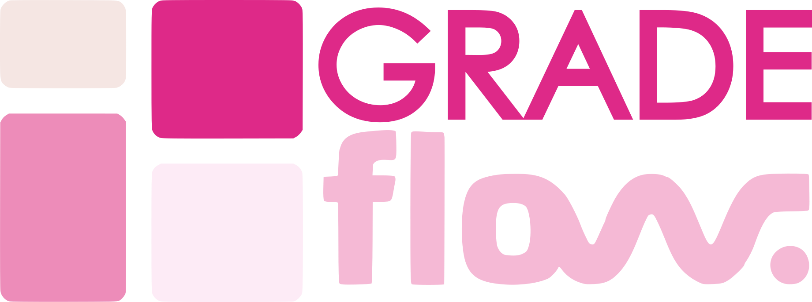

<div align="center">



### Your academic life, in flow.

A mobile-first student productivity app for tracking grades, planning deadlines,
and staying focused — wrapped in a warm, accessible pink design system.

</div>

---

## ✨ Overview

**GradeFlow** helps students see their whole academic picture at a glance: current
standing and GPA, upcoming deadlines, study time against weekly goals, and per-module
performance. It combines a grade tracker, a focus timer, a deadline planner, and a
"what-if" grade simulator in one clean, touch-friendly interface.

## 🎯 Features

| Screen | What it does |
|--------|--------------|
| **Dashboard** | Overall average, GPA, weekly study time, today's focus goal, upcoming deadlines, and active-module performance at a glance |
| **Modules** | Manage courses and syllabus, view per-module averages and study hours |
| **Marks** | Log assessment marks and track grades over time |
| **Focus** | Built-in study session timer with ambient audio |
| **Calendar** | Deadlines and events, sorted and color-coded by module |
| **Analytics** | Performance trends and study-time breakdowns |
| **Profile** | Semester, target GPA, and weekly study goals |
| **What-If Simulator** | Model how future marks would change your final grade |

## 🎨 Design System

GradeFlow uses a signature pink palette from the brand board, with an accessible,
mobile-first layout.

**Palette**

| Token | Hex | Role |
|-------|-----|------|
| Primary | `#dd2987` | Primary magenta — actions, accents |
| Rose | `#ec68a0` | Gradient partner, highlights |
| Pink | `#ed8cb9` | Secondary accents |
| Soft | `#f6b9d5` | Hairlines, borders |
| Blush | `#fdedf5` | App background |
| Cream | `#f5e6e3` | Warm off-white |
| Ink | `#2c1228` | Primary text (near-black plum) |
| Muted | `#7a5672` | Secondary text (AA-compliant) |

**Typography**

- **Fraunces** — warm display serif for page titles _(brand: Avigea)_
- **Dancing Script** — script accent for the tagline _(brand: Better Together)_
- **Plus Jakarta Sans** — body & data
- **Outfit** — UI headings

**Accessibility**

- WCAG AA text contrast (muted text ≥ 4.5:1 on all surfaces)
- Visible keyboard focus rings on every interactive control
- ≥ 44px touch targets; bottom nav fits down to 320px with no overflow
- Pinch-zoom enabled; safe-area insets for notched devices
- Honors `prefers-reduced-motion`

## 🛠 Tech Stack

- **React 19** + **TypeScript**
- **Vite 6** build tooling
- **Tailwind CSS 4**
- **Framer Motion** (`motion`) for transitions
- **Recharts** for analytics
- **lucide-react** icons
- **@google/genai** (Gemini) for AI features

## 🚀 Run Locally

**Prerequisites:** Node.js

```bash
# 1. Install dependencies
npm install

# 2. (Optional) Set your Gemini API key for AI features
#    Copy .env.example to .env.local and fill in GEMINI_API_KEY

# 3. Start the dev server
npm run dev
```

The app runs at **http://localhost:3000**.

**Other scripts**

```bash
npm run build     # production build
npm run preview   # preview the production build
npm run lint      # type-check with tsc
```

## 📁 Project Structure

```
src/
├─ components/        # HeaderBar, BottomNavBar, GradeFlowLogo, modals/
├─ context/           # AppContext — global state
├─ data/              # initial seed data
├─ utils/             # academic calculations, audio synth
├─ views/             # Dashboard, Modules, Marks, Focus, Calendar, Analytics, Profile
├─ index.css          # design-system tokens & accessibility primitives
├─ types.ts
└─ main.tsx
public/
├─ g5.png             # 4-block icon (favicon)
└─ g12.png            # full wordmark logo (banner above)
```

---

<div align="center">
<sub>GradeFlow — track it, plan it, flow through it. 🎓</sub>
</div>
